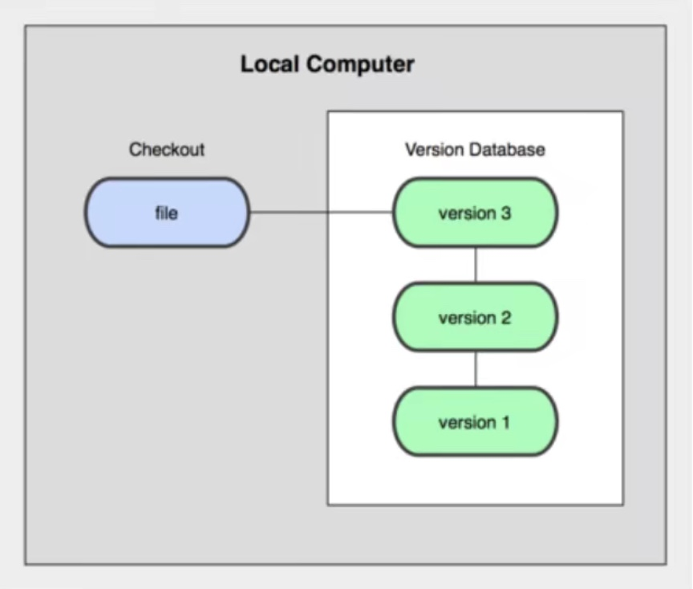
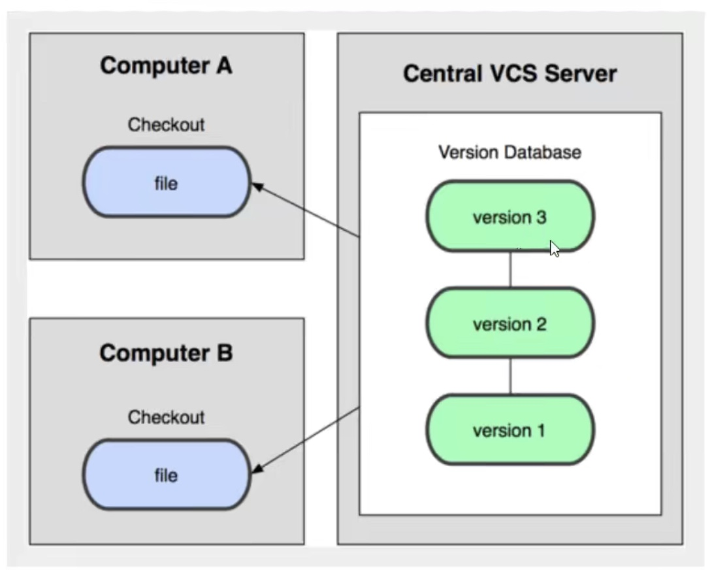
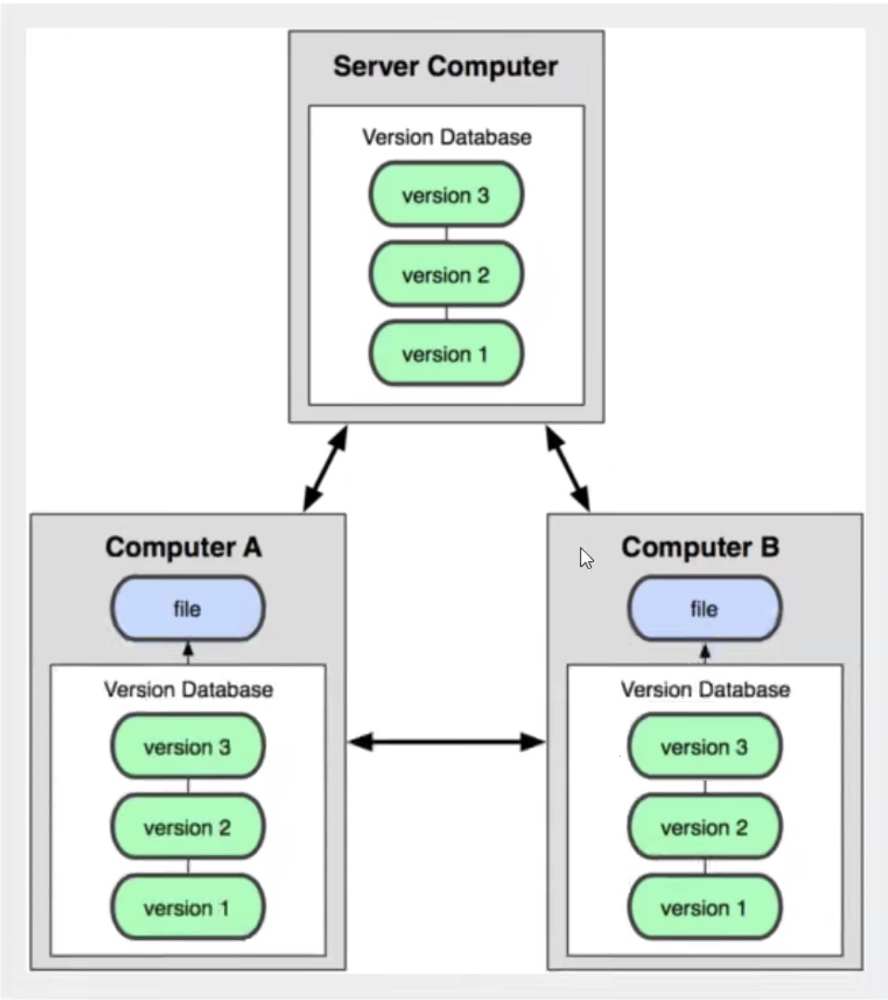
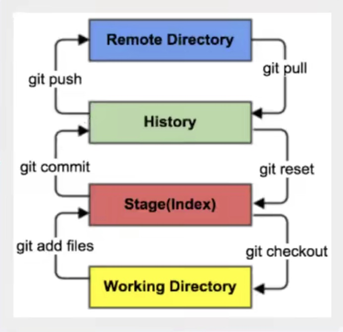
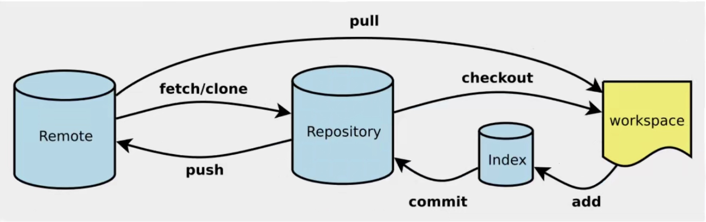

原文链接：<https://mp.weixin.qq.com/s/Bf7uVhGiu47uOELjmC5uXQ>

视频链接：<https://www.bilibili.com/video/BV1FE411P7B3?p=13>

版本控制(Revision Control)
======================

版本控制的分类
-------

1\. 本地版本控制 

------------



2\. 集中式版本控制（例如 SVN）



3\. 分布式版本控制（例如 Git）



Git和SVN的区别
----------

SVN 是集中式版本控制系统；需要联网才能工作

Git 是分布式版本控制系统；无需联网就能工作

```python
$ git config --global --list # 查看当前用户（global）的配置
$ git config --system --list # 查看系统config  

$ cat ~/.gitconfig # 查看用户配置文件
$ vi ~/.gitconfig # 编辑用户配置文件
```

Git基本理论
=======



git的工作流程一般是这样的：

1\. 在工作目录中添加、修改文件；

2\. 将需要进行版本管理的文件放入暂存区域；git add .

3\. 将暂存区域的文件提交到git仓库。 git commit

因此，git管理的文件有三种状态：已修改（modified）,已暂存（staged）,已提交（committed）

Git项目搭建
=======



### 本地仓库搭建

1\. 创建全新仓库，需要用git管理的项目的根目录执行：

```python
# 在当前目录新建一个Git代码库
$ git init
```

2\. 执行后可以看到，仅仅在项目目录多出了一个.git目录，关于版本等的所有信息都在这个目录里面。

### 克隆远程仓库

将远程服务器上的仓库完全镜像一份至本地

```python
# 克隆一个项目和它的整个代码历史(版本信息)
$ git clone [url]
```

Git文件操作
=======

### 文件的四种状态

版本控制就是对文件的版本控制。要想对文件进行修改、提交等操作，首先要知道文件当前处于什么状态，不然可能会提交了现在还不想提交的文件，或者要提交的文件现在还没提交上。

* untracked: 未跟踪。此文件在本地文件夹里，但并未加入到git库，不参与版本控制。通过git add状态变为staged。
* unmodify: 文件已入git库，版本库中的文件快照内容与本地文件夹中完全一致。该状态有2种去处：1）如果它被修改，就变为modified；2）如果使用git rm移除版本库，则称为untracked文件。
* modified: 文件已修改。该状态有2种去除：1）通过git add可进入暂存staged状态；2）通过git checkout丢弃修改，返回到unmodified状态（即从库中取出该文件，覆盖当前修改）。
* staged: 暂存状态。2种去处：1）执行git commit将修改同步到库中，这时库中的文件和本地文件变为一致，文件变为unmodified状态；2）执行git reset HEAD filename取消暂存，文件状态为modified。

### 文件状态的相关操作

```python
# 查看指定文件状态
git status [filename]

# 查看所有文件状态
git status

# 添加所有文件到暂存区
git add .

# 提交暂存区中的内容到本地仓库
git commit -m "消息内容"
```

### 忽略文件

有时我们不想把某些文件纳入版本控制，比如数据库文件、临时文件、设计文件等。

在主目录下建立 ".gitignore” 文件，此文件有如下规则：

1. 文件中的空行和以井号(\#)开始的行会被忽略。
2. 可以使用Linux通配符。\* 代表多个字符；? 代表一个字符；[abc] 代表可选字符范围；{string1, string2, …} 代表可选字符串。
3. 如果名称最前面有一个 ! 号，表示例外规则，将不被忽略。
4. 如果名称的最前面是一个路径分隔符 ( / )，表示要忽略的文件在此目录下，而此目录的子目录中的同名文件不被忽略。
5. 如果名称的最后面是一个路径分隔符 ( / )，表示要忽略名称文件夹下的所有文件。

```python
#为注释
*.txt        #忽略所有 .txt结尾的文件,这样的话上传就不会被选中！
!lib.txt     #但lib.txt除外
/TODO        #表示仅仅忽略项目根目录下的 TODO 文件，不包括 subdir/TODO
build/       #忽略build/目录下的所有文件
doc/*.txt    #会忽略 doc/notes.txt 但不包括 doc/server/arch.txt
```

